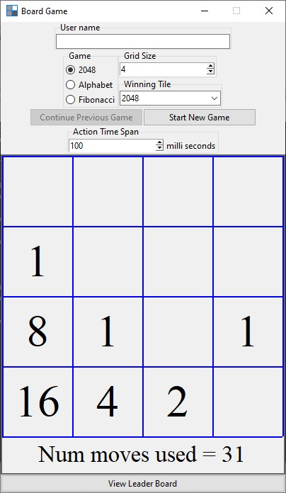
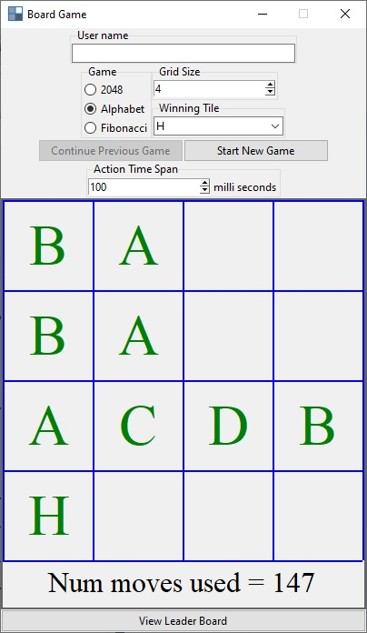
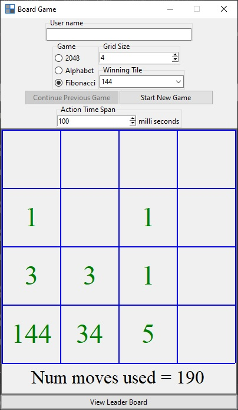
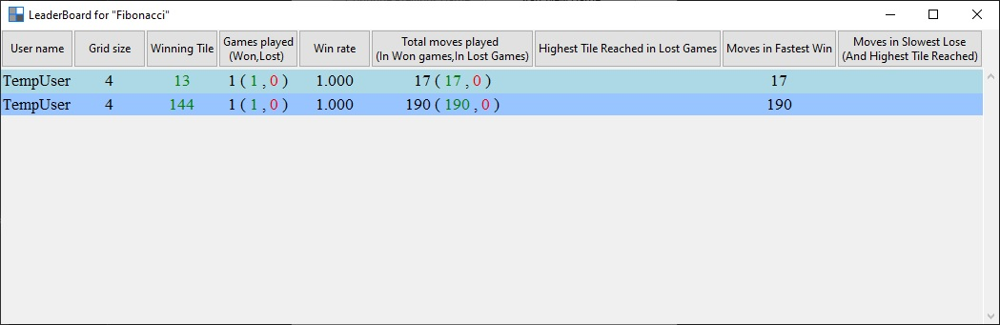

# Games 2048 type

This project is an extensible 2048 type game.

It can be run with python 3.

Screenshots are included at the bottom.

Features:

1. Three games types are already written (the game mechanics is same as the game 2048)
    * 2048 (equal numbers combine into their sum)
    * Fibonacci (adjacent fibonacci numbers combine to form the next fibonacci number)
    * Alphabet (same letters combine to form next letter in the alphabet)
2. The grid size and the winning tile can be chosen.
3. The results of games are saved and leaderboard can be viewed.
4. Easily extensible. New type of games can be added by inheriting from Base class in Base.py, and adding that new class name to the list at the top of main.py. See Base.py to know what needs to be overwritten. Use any of Game2048.py, Alphabet.py, Fibo.py as example. All of them extend the Base class.

## Screenshot: Playing 2048

## Screenshot: Playing Alphabet

## Screenshot: Playing Fibonacci

## Screenshot: Leaderboard of Fibonacci game

Note: When "Show leaderboard" is clicked, the leaderboard of the game currently selected is shown. The buttons on the title row of the leaderboard can be clicked for sorting.